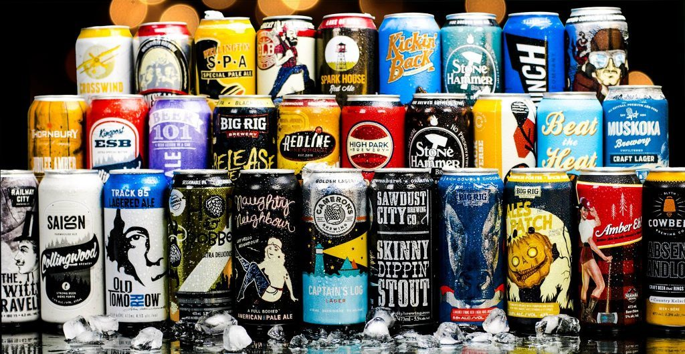

# Oxybeeron

# Motivation

I have been bartending for the last three years at a craft beer bar. During this time, I've come to realise that people have very unique tastes in beer, however, they rarely can name their style preferences, beyond 'lager' and 'ale'. In addition, there is an abundance of high quality craft beers in Ontario (and Canada for that matter), and if domestic beer drinkers knew which craft beers were similar to their Stellas and their Boneshakers, they could more easily explore the developing craft beer world. This recommender system aims to make beer selection easier for these beer drinkers, and further assist beer drinkers, like me, who are looking for their next big beer obsession. 

# Recommender Systems

It's hard to surf the web these days and not come into contact with a recommender system. Amazon, YouTube, and Netflix are just a few of the online services that attempt to make your life  easier (and make a few extra bucks in the process) by suggesting things you may like, based on your explicit feedback, and increasingly more so, on your implicit feedback.

Three types of Recommender Systems:

1. Content Based. Broadly speaking, this system is based on the premise that if you like one item, you will like another similar item. In terms of beer, if you like Guinness, you will most likely like other stouts, especially ones poured with a creamer.

2. Collaborative Based. This system focuses on the relationship between users and items. Strictly speaking, similar people like similar items. If person A and B, like Corona, Coors Light, and Heineken, and person A loves Sawdust City Little Norway, a Collaborative Based recommender system would recommend Little Norway to person B.

3. Hybrid Systems. This system combines Content and Collaborative systems. For example, if person C likes imperial stouts and IPAs. And person D also likes imperial stouts, but hates IPAs, a hybrid system would recommend other imperial stouts that person C liked to person D.

# Objective

My objective when setting out to do this capstone project was to be able to recommend beer to users in a hybrid system. I wished to make a system that could tackle the cold start problem (the idea that new users and new beers do not have ratings) but also take into account collaborative and content information to recommend beer to avid users.

# Data

The data for the project was collected via scraping two websites:

1. BreweryDB. I used an API key to compile over 20,000 beers from BreweryDB's database. I then filtered out beers, to be left with beer from Ontario, Quebec, Macro Breweries, and well-known US Breweries with beer readily available in Toronto.

2. Beer Advocate. To supplement the list of beers from BreweryDB, I used beautiful soup to scrape the Top 100 favourite beers in Ontario from the Beer Advocate. Luckily there was not much overlap between the two sets.

3. User database. In order to simulate a user base, I created two Google documents:
        
        a) Beer Form: I created a beer form and shared it on Facebook and the Bitmaker Slack channels. Users were asked
            to rate from 1 to 10, 20 beers that were representative of Macro and Micro Breweries, and of various styles.                 
        
        b) Google Spreadsheet: I convinced close friends and co-workers to look at the entire dataset, containing 628 beers         
            and rate those beers they have tried out of 10.

I was left with:  

                  628 Beers (338 beers after deleting beer with no ratings after user feedback)
                  
                  86 beer form respondents
                  
                  15 Google Spreadsheets' super-users
           
           
# Tools and Packages Used

Stack
  
        -Python
        -Git
  
Web Scraping
        
        -Requests
        -Beautiful Soup
        -json
        -pickle
  
Feature Engineering and Modeling
        
        -Pandas
        -Scipy
        -Numpy
        -Matplotlib
        -KNN
        -Sckit-learn
        -Spotlight
        -regex
  
Web App:
          
          -Flask
          -HTML

# Models

Model 1: Spotlight Recommender Model (Collaborative)

For the first model I used the Spotlight Recommender system. The precision at K was .18 after tuning parameters. The recommendations seemed to be skewed by the data compiling decisions I had made. For none super users, it would only recommend those 20 beers thats were part of the Beer Form.

Model 2: KNN Model (Collaborative)

A KNN model is a non-parametric model that seperates data points into several clusters and then makes inferences for new samples by measuring the distance between the target beer and the closest beers to it. This model relies on user-item ratings.

Model 3: Cosine Similarity Model (Content)

Cosine Similarity measures the similarity between two non-zero vectors. For example, two vectors that share the same orientation have a cosine similarity of 1. This method recommended beer based on similar styles. Due to the relatively small dataset, I personally mapped over 100s styles down to 31. 

Model 4: Kristi's Hybrid Model (oxybeeron.py)

My hybrid model (which is connected to the flask app), provides 10 beer recommendations based on the collaboration of the above three models. Anything that is recommended by Model 1 and Model 2 is automatically recommended, and then the final recommendation spots are filled out by Model 3. The flask app, allows the 'online' user to choose from a list of 10 beers; their preferences, and then this model, in turn, recommends beer based on this hybrid model.

Model 5: Super-User Model (spotlight_model_superuser_version.py)

This hybrid model is an example of how the collaboration of these three models can be tweaked to conform to different datasets. This model does not work on the entirety of the user base, but for those who filled out the entire Google Spreadsheet (my 'Super Users), this model is effective. This model relies on the top recommendations provided by Spotlight. It then fetches all the beer that a certain user rated as 8 or above and then uses the cosine similarity and KNN model functions to list content similarity and user-item interaction similarity. The final function (def super_user_recs) takes in a user id number and then recommends the beers that are present in the Spotlight recommendations, and in the combination of the KNN and cosine similarity recommendations. This model effectively recommends beer based on similar user preferences, but also considers the users preferences for style.

# Final Thoughts

The oxybeeron app was a nice introduction to recommender systems. It relied more heavily on, and was more effective with, the more basic models, like KNN and Cosine Similarity. This was simply because there was not enough data for Spotlight to do its magic. However, the combination of these three models, provided a basic blueprint for a hybrid model that could be quite effective.

The effectiveness of the Cosine Similarity Model with only 31 beer styles, makes me optimistic about its potential in a larger dataset where the number of beer styles could be more expansive. For example, instead of "IPAs", it could include specific IPAs (Double IPAs, Session IPAs, Vermont-Style IPAs, Black IPAs, hazy IPAs, etc.) Furthermore, it could include other features, like IBU, hop varietals, and alcohol percentage.

Overall, it became painfully obvious that it's hard to find information and examples online for recommender systems that are not based on the movielens dataset. I think that for Spotlight to work to the best of its ability, my dataset would need to be much larger than 101 users and 338 beers. However, the improvement in its ability to recommend beer for my super users is promising. Model 5 shows that in the interim between a cold start situation and a 100K+ dataset (aka MovieLens), Spotlight can be quite effective if it is combined with other recommendation algorithms. Using these three models, in tandem, resulted in the ability to make solid recommendations for users in a smaller network.
